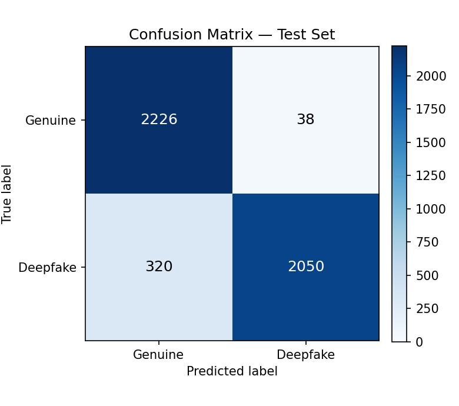
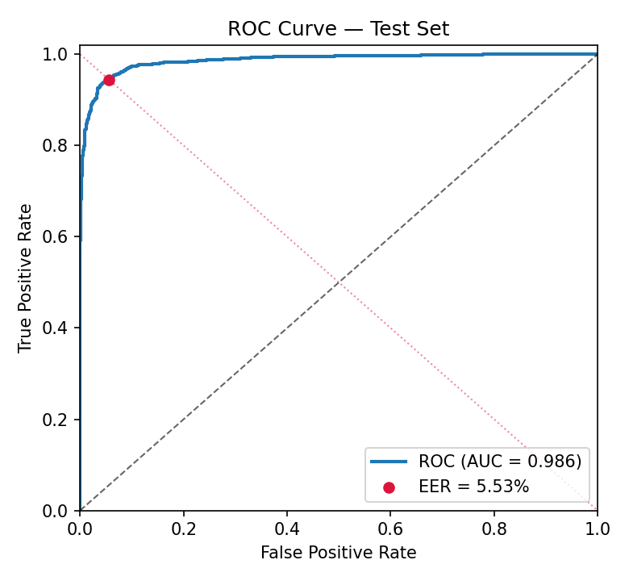

# Performance Report — Deepfake Audio Detection

*Generated automatically by `src/evaluate.py` on 2026-06-15 12:50:29.*

- **Model checkpoint:** `/kaggle/working/models/best_model.pt`
- **Selected at epoch:** 11 (validation EER 0.28%)
- **Test directory:** `/kaggle/input/datasets/mohammedabdeldayem/the-fake-or-real-dataset/for-norm/for-norm/testing`
- **Test samples:** 4634  (Genuine: 2264, Deepfake: 2370)

## Verification result: ✅ PASS

A submission is valid only if **both** primary thresholds are met (§5). The secondary thresholds (§4) are also checked below.

### Primary metrics (§5)

| Metric | Value | Required | Status |
|---|---|---|---|
| Overall Accuracy | 92.27% | ≥ 80% | ✅ |
| Equal Error Rate (EER) | 5.53% | ≤ 12% | ✅ |

### Secondary metrics (§4)

| Metric | Value | Required | Status |
|---|---|---|---|
| F1 Score (macro) | 92.26% | ≥ 80% | ✅ |
| Per-Class Accuracy — Genuine | 98.32% | ≥ 75% | ✅ |
| Per-Class Accuracy — Deepfake | 86.50% | ≥ 75% | ✅ |

### Confusion matrix

Rows = true class, columns = predicted class.

| | Pred: Genuine | Pred: Deepfake |
|---|---|---|
| **True: Genuine** | 2226 | 38 |
| **True: Deepfake** | 320 | 2050 |

### Additional metrics

- F1 (Genuine): 92.56%
- F1 (Deepfake): 91.97%
- Precision (macro): 92.81%
- Recall (macro): 92.41%
- EER operating threshold: 0.209
- FAR at EER threshold: 5.53%
- FRR at EER threshold: 5.52%

### Figures

---

Label convention: **0 = Genuine (Human)**, **1 = Deepfake (AI-Generated)**. The detection score is the model's deepfake probability; EER is computed with *deepfake* as the positive class.
